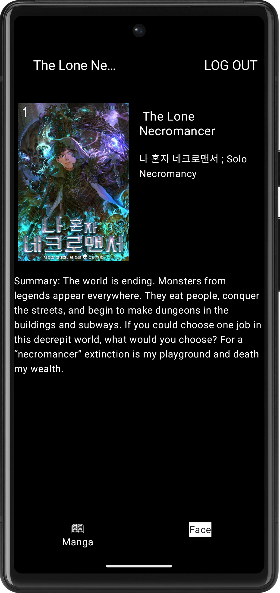

# MangaVerse
## Overview
MangaVerse is a simple Android application built using Clean Architecture + MVVM, Jetpack Compose for UI, and Single Activity Architecture with the Jetpack Navigation Component. The app includes user authentication, manga data fetching & caching, and real-time face recognition using MediaPipe.

## Features
### 1. Sign In Screen (User Authentication with Room DB)
Users can sign in using their email and password.
If the entered email does not exist, a new account is created, and the user is signed in.
User credentials are securely stored in Room Database.
On app launch:
If a user is already signed in, they are navigated to the Home Screen (with Bottom Navigation).
If no user is signed in, they are navigated to the Sign In Screen (no Bottom Navigation).
### 2. Bottom Navigation with Two Items
A Bottom Navigation Bar is implemented with two items:
#### Manga Screen: 
Displays manga data.
#### Face Recognition Screen: 
Displays a live camera feed with face detection.

### 3. Manga Screen (Fetch & Cache Manga Data)
Fetch manga data from the MangaVerse API using the fetch-manga endpoint. 
API: <a href="https://rapidapi.com/sagararofie/api/mangaverse-api">MangaVerse API</a>

Features:
<ul>
  <li>Pagination for smooth scrolling and efficient data loading.</li>
  <li>Fetched manga data is stored in a Room Database for offline access.</li>
  <li>On app launch:
    <ol>
  <li>Display cached data if offline.</li>
  <li>Refresh the cache when the internet is restored.</li>
    </ol>
  <li>On selecting a manga item, navigate to a Manga Description Screen displaying detailed information.</li>
</ul>
<h3> 4. Face Recognition Screen (Face Detection Using MediaPipe)</h3>
<ul>
<li>Uses the front camera to display a live camera feed.</li>
<li>Integrates the MediaPipe Face Detection model:</li>
  <ol>
<li>Detects the user's face in real time.</li>
<li>Draws a reference rectangle on the screen.</li>
  </ol>
<li>If the detected face is within the rectangle, the rectangle is displayed in green; otherwise, it is displayed in red.</li>
</ul>
<h3> 5. Architecture & Best Practices</h3>

<h4>Clean Architecture + MVVM:</h4>
<b>Separation of concerns with clear layers:</b> Data and Presentation. 
<b>Jetpack Compose</b> for modern, declarative UI. 
<b>Single Activity Architecture</b> with <b>Jetpack Navigation Component</b> for seamless navigation. 

<h2>Tech Stack</h2>
<b>Programming Language:</b> Kotlin 
<b>UI Framework:</b> Jetpack Compose 
<b>Architecture:</b> Clean Architecture + MVVM 
<b>Navigation:</b> Jetpack Navigation Component 
<b>Database:</b> Room Database 
<b>Networking:</b> Retrofit + OkHttp 
<b>Face Detection:</b> MediaPipe Face Detection 
<b>Dependency Injection:</b> Hilt 
<b>Asynchronous Programming:</b> Kotlin Coroutines + Flow 

<h2>Setup Instructions</h2>

1. Clone the repository:

    git clone https://github.com/Rahula-12/Zenithra.git 
    cd Zenithra

2. Open the project in Android Studio.
3. Add your RapidAPI Key for the MangaVerse API:
<ul>
	<li>Navigate to local.properties and add:   RAPID_API_KEY=your_rapid_api_key</li>
 </ul>

4. Build and run the app on an Android device or emulator.

5. You can also download the apk and run it on your Android Device using following link:- https://github.com/Rahula-12/Zenithra/releases/download/debug/app-debug.apk

<h2>API Integration</h2>
<ul>
<li><h3>MangaVerse API:</h3></li>
</ul>
<ol>
  <li><b>Endpoint:</b> https://mangaverse-api.p.rapidapi.com/fetch-manga</li>
  <li><b>Documentation:</b> <a href="https://rapidapi.com/sagararofie/api/mangaverse-api">MangaVerse API</a></li>
</ol>

<h2>Screenshots</h2>
<h3>1. Sign In Screen</h3>

<h3>2. Manga Screen</h3>

<h3>3. Manga Detail Screen</h3>

<h3>4. Face Inside Box</h3>

<h3>4. Face Outside Box</h3>

<h2>Key Features</h2>
<h3>Clean Architecture</h3>
	1. <b>Data Layer:</b> Handles data sources (API, Room DB). 
	2. <b>Presentation Layer:</b> Manages UI, user interactions and contains business logic inside viewmodels. 
<h3>Jetpack Compose</h3>
<ul>
  <li>Declarative UI for building modern Android apps.</li>
</ul>
<h3>Room Database</h3>
<ul><li>Caches manga data for offline access.</li></ul>
<h3>MediaPipe Face Detection</h3>
<ul><li>Real-time face detection with visual feedback.</li></ul>

<h2>Future Enhancements</h2>
	1. Add user profile management. 
	2. Enhance face detection with additional features (e.g., emotion detection). 

<h2>Video</h2>
Checkout this video:-

https://www.loom.com/share/ef84ecf288184c0da471326e55d99e81?sid=d58441a5-3a18-4913-82d5-95185c5db38d

<h2>Contributing</h2>
Contributions are welcome! Please fork the repository and submit a pull request.

<h2>Contact</h2>
For any questions or feedback, feel free to reach out: 
<b>Email:</b> ra9853044@gmail.com 
<b>GitHub:</b> Rahula-12
